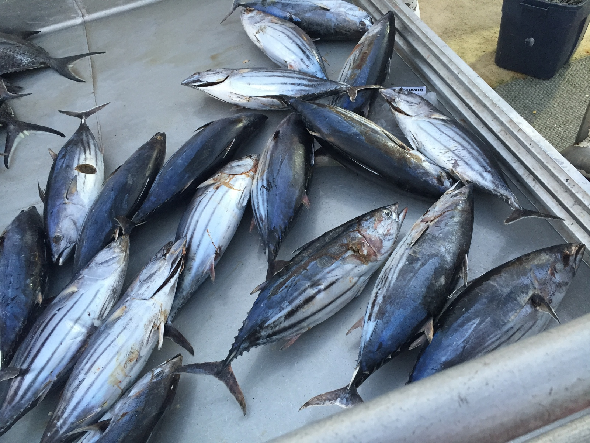
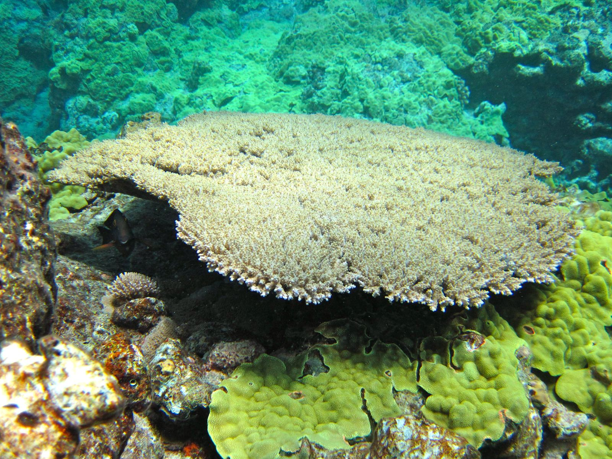
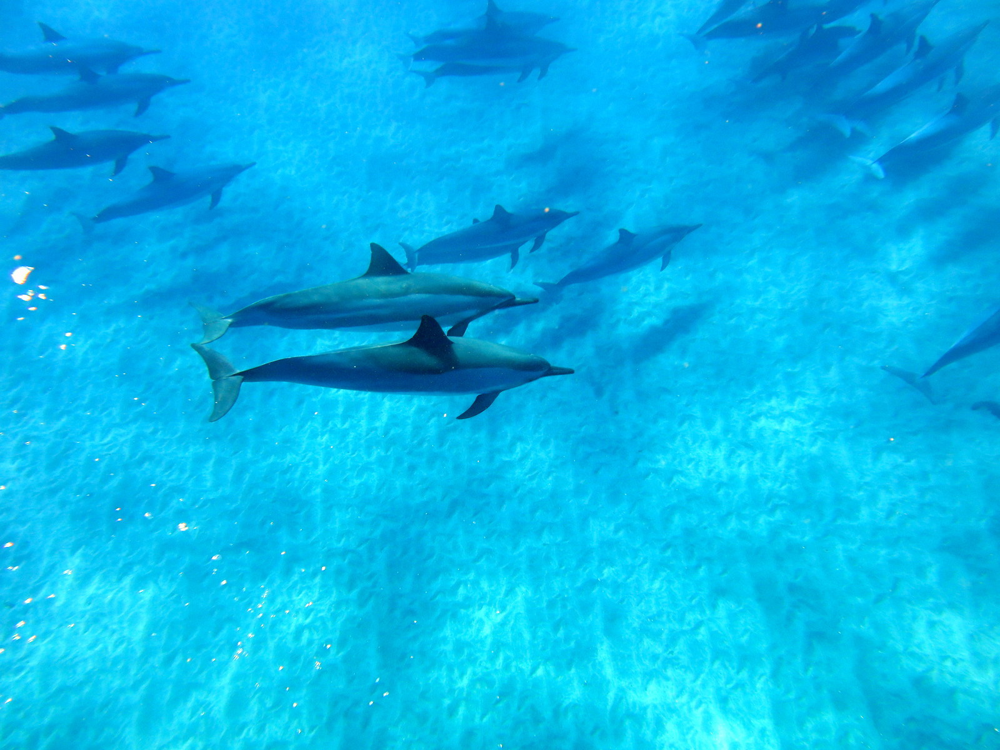

----

The global Ocean Health Index developed 10 goals that encompass ocean health: Food Provision, Natural Products, Clean Water, Coastal Protection, Carbon Storage, Biodiversity, Tourism & Recreation, Livelihoods & Economies, Artisanal Fishing Opportunities, and Sense of Place. These goals for the OHI were adapted from the global framework and the ten goals for the Hawaii OHI are Food Provision, Natural Products, Clean Water, Coastal Protection, Biodiversity, Tourism, Livelihoods & Economies, Recreation, Artisanal Fishing Opportunities, and Sense of Place. The Carbon Storage goal is not included in the Hawaii Ocean Health Index as it lacks the necessary information such as extent of seagrasses and carbon storage capacity. Additionally mangroves are present in Hawaiʻi but are invasive and there is not a consensus on whether to include mangroves for this goal.

  

Indicators for each goal have been drafted through stakeholder engagement and expert review are available [here](https://goo.gl/1QT68E).

  

 

    
##Food Provision
*Wild Caught Fisheries*: Measures the amount of wild-caught seafood (pelagic, bottom, and nearshore fishes) that can be sustainably harvested. Data gaps are recognized such as the lack of stock assessments for many harvested species. Additionally, traditional stock assessments do not take ecosystem impacts into account and ecosystem models are preferred if they become available.

*Mariculture*: Measures the sustainable production potential (fishponds) and current production of seafood weighted by a sustainability/risk score (use of non-native species and the % of feed imported).
  

##Natural Products
This goal measures the sustainable harvest of ocean-derived resources for purposes other than direct consumption. Resources under this goal include salt, shells, medicinal products and aquarium fish. The goal will be measured as the commercial value (revenue) and/or cultural or medicinal value of products weighted by a risk/sustainability score that will be developed for each species assessed.  

##Livelihoods & Economies
Most livelihoods in Hawaii are directly or indirectly linked to tourism. This goal aims to measure the benefits that tourism provides while taking into account the integrity of the culture of Hawaii and the protection of the natural environment, i.e. sustainable tourism.  

##Tourism 
This goal strives to measure the balanced economic growth through tourism with management and preservation of natural resources and Hawaiian culture. This is measured through tracking ocean management areas to preserve the  environment and provide visitor ecotourism opportunities, educational programs embedded in the tourism industry, and the representation of community values and voice.  

##Coastal Protection
This goal measures the natural protection of coastal habitats measured as the extent and condition of beaches/sand dunes, coral reefs, wetlands that provide coastal protection from inundation and erosion. The target for wetlands is no net loss of wetlands and/or number of acres effectively managed. The target for beaches/sand dunes will be a temporal reference to the historical extent. The condition for coral reefs will be measured through percent coral cover and/or the ratio of cacifiers to non-calcifiers. Goal also could include other indicators of coastal protective ability including intertidal area, slope and rugosity of the nearshore environment, and the ratio of coastal development to the natural environment.   

##Biodiversity

 
   
*Habitats*: The habitats sub-goal of biodiversity measures the extent, condition, and level of management protection of coastal and terrestrial habitats. Habitats include coral reefs, wetlands, anchialine ponds, pelagic water column, beaches, fishponds, and watersheds. 

     
 

 
    
*Species*: This sub-goal of biodiversity measures the population status of species including biodiversity (species richness), abundance, percent endemism, and risk of extinction (from IUCN red list classifications).        

##Artisanal Fishing Opportunities
This goal measures the opportunity for fishers to supply seafood for themselves, families, and community.   

##Sense of Place
The past, present, and future connection between people and place.
